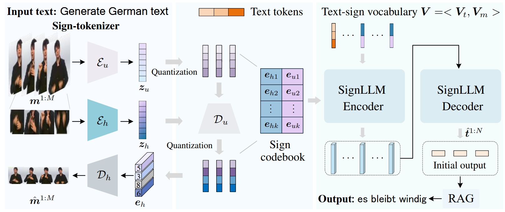
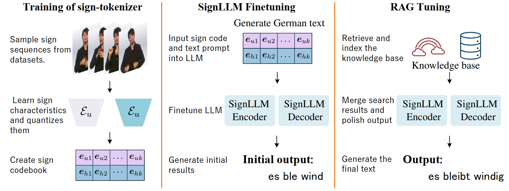
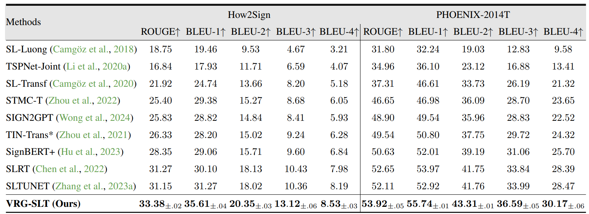

# HYBRID MODEL COLLABORATION FOR SIGN LANGUAGE TRANSLATION WITH VQ-VAE AND RAG-ENHANCED LLMS
Data shortages and the phonetic disparity between sign and spoken languages have historically limited the quality of sign language translation. On another front, endowed with substantial prior knowledge, large language models perform exceptionally well across diverse tasks, significantly diminishing the demand for domain-specific training data. Building on these foundation, this paper presents VRG-SLT, an innovative framework that translates sign language into spoken language, facilitating communication between signing and non-signing communities. In practice, VRG-SLT utilizes a hierarchical VQ-VAE to convert continuous sign sequences into discrete representations, referred as sign codes, which are subsequently aligned with text by a fine-tuned pre-trained language model. Additionally, retrieval-augmented generation (RAG) is employed to extend and enhance the language model, producing more semantically coherent and precise spoken text. Featuring a hierarchical VQ-VAE and pre-trained large language models, VRG-SLT demonstrates state-of-the-art performance. It excels on modish benchmarks like How2Sign and PHOENIX-2014T. Moreover, the incorporation of additional factual knowledge through RAG further improves the accuracy of the generated text. The implementation code will be released.


### Framework

VRG-SLT mainly comprises a sign-tokenizer and a sign-aware language model, SignLLM. The sign-tokenizer encodes sign actions into a sign codebook and, together with the text tokenizer, creates a unified vocabulary $V$ . Using SignLLM, we perform joint learning of sign and spoken languages for sign language translation. The two encoders of the sign-tokenizer encode global body movements and detailed hand features, respectively, achieving a comprehensive and precise understanding of sign motion. Finally, we refine the initial output using a RAG strategy.


### TRAINING PROCEDURES

VRG-SLT comprises three steps: First, sign-tokenizer learns a codebook for discrete sign representations. Next, we train the language model SignLLM using a mix of spoken and sign data to understand the semantic coupling between text and sign motion. Finally, we polish the initial output using RAG.


### PSEUDO CODE
##### Trainging of sign-tokenizer
```python
# Initialize the hierarchical encoders, decoders, and quantizers
def training(sign_motions, hand_motions):
    # Encode images at multiple scales to get hierarchical latent representations
    Z_upper = encode_upper(sign_motions); Z_hand  = encode_hand(hand_motions)
    
    # Quantize the latent representations of upper body
    Q_upper = vector_quantize_top(Z_upper)
    Dec_upper = decoder_upper(Q_upper)
    
    # Combine quantized representations from different scales
    combined_Z = combine(Dec_upper, Z_hand)
    Q_hand = vector_quantize_hand(combined_Z)
    
    # Decode combined quantized representations to reconstruct motions
    reconstructed_motions = decode(Q_hand)
    
    # Compute reconstruction loss between original motions and reconstructed_motions
    reconstruction_loss = compute_loss(sign_motions, reconstructed_motions)
    
    # Compute quantization loss for top and bottom levels
    quantization_loss_upper = compute_loss(Z_upper, Q_upper)
    quantization_loss_hand = compute_loss(Z_hand, Q_hand)
    
    # Total quantization loss is the sum of top and bottom quantization losses
    total_quantization_loss = quantization_loss_upper + quantization_loss_hand
    
    # Total loss is the sum of reconstruction loss and total quantization loss
    total_loss = reconstruction_loss + total_quantization_loss
    
    # Update model parameters based on total_loss
    update_parameters(total_loss)
```

##### Finetuning the large language model FLAN-T5

```python
# Initialize the FLAN-T5 model
def finetuning(batch):
    # Inputs are sign language tokens combined with text prompts
    sign_tokens, text_prompts = batch['sign_tokens'], batch['text_prompts']
    
    # Combine tokens with prompts to form the input for the model
    model_input = concatenate(sign_tokens, text_prompts)
    
    # Expected translation as output
    expected_output = batch['translated_text']
    
    # Perform model training with input and expected output
    loss = train_model(model_input, expected_output)
    
    # Update model parameters based on the loss 
    update_parameters(loss)
        
def inference(sign_tokens, text_prompt):
    # Combine sign language tokens with text prompt for inference
    input_for_inference = concatenate(sign_tokens, text_prompt)
    
    # Generate translation using the fine-tuned model
    translated_text = generate_translation(input_for_inference)
    
    return translated_text

# Example sign_tokens and text_prompt for testing inference
test_sign_tokens = ['sign_token1', 'sign_token2', 'sign_token3']
test_text_prompt = "Translate the following sign language sequence:"
translation = inference(test_sign_tokens, test_text_prompt)
print("Translated text:", translation)
```

##### Tuning with RAG

```python
# Initialize the BERT model for retrieval and a RAG module for refinement
def indexing(corpus):
     # Index the corpus with BERT to facilitate efficient retrieval
     indexed_corpus = bert_index(corpus)
     return indexed_corpus

def retrieving(initial_translation, indexed_corpus):
     # Use BERT to retrieve relevant documents or context from the indexed corpus
     retrieved_documents = bert_retrieve(initial_translation, indexed_corpus)
     return retrieved_documents
    
def generation(initial_translation, retrieved_context):
     # Combine the initial translation from FLAN-T5 with retrieved context
     combined_input = concatenate(initial_translation, retrieved_context)
    
     # Use the generator model to refine the translation
     refined_translation = generator_model(combined_input)
     return refined_translation

def inference(sign_tokens, text_prompt):
    # Generate initial translation using FLAN-T5
    input_for_inference = concatenate(sign_tokens, text_prompt)
    initial_translation = flan_t5_generate_translation(input_for_inference)
    
    # Index the relevant corpus if not already indexed (can be pre-indexed)
    indexed_corpus = index_corpus(corpus)  # Assuming 'corpus' is predefined or loaded
    
    # Retrieve context based on the initial translation
    context = retrieve_context(initial_translation, indexed_corpus)
    
    # Generate the final, refined translation using the retrieved context
    final_translation = generate_refined_translation(initial_translation, context)
    return final_translation
    
# Example usage:

# Assuming corpus is available and FLAN-T5 is pre-trained
test_sign_tokens = ['sign_token1', 'sign_token2', 'sign_token3']
test_text_prompt = "Translate the following sign language sequence:"
final_translation = inference(test_sign_tokens, test_text_prompt)
print("Final Translated text:", final_translation)
```

### Compared with state-of-the-art methods

